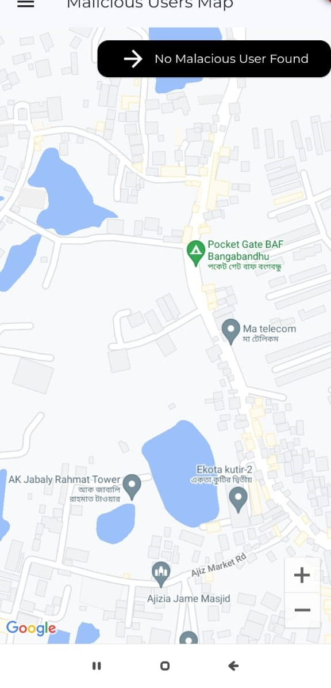
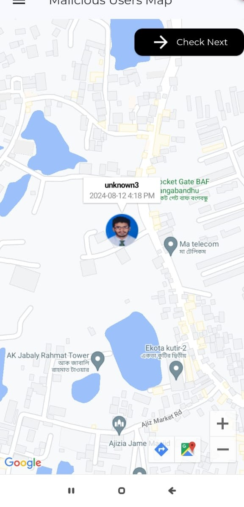
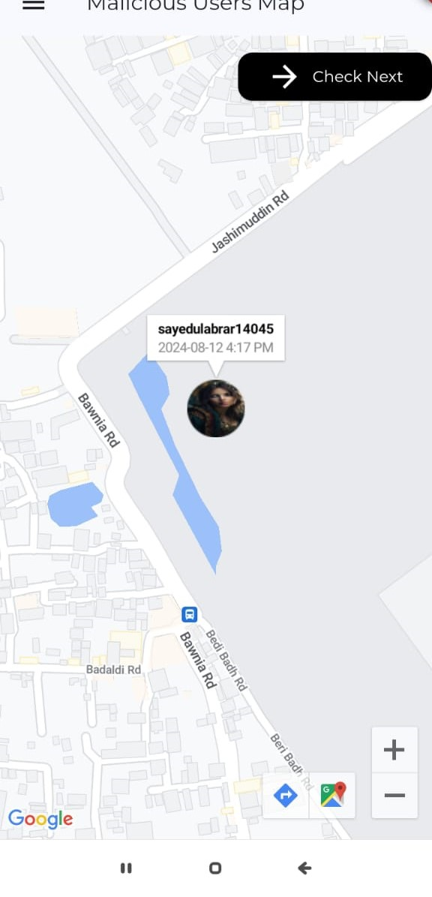

# 🛡️ SecureChat - Your Ultimate Privacy Companion 🛡️

## 📥 Download the Final App

To download the final version of **SecureChat**, check the **finalapp** folder.

Welcome to **SecureChat** - the most robust, feature-rich, and secure chat application designed to keep your conversations private and your data safe. Dive into a world where your messages are shielded from prying eyes, and enjoy a seamless communication experience with cutting-edge features!

## App Pages

**[📝 Disabled users are indicated using a red sign on their user type and in the Add User page Icons.block.]**

| Log In Page                 |   | Home Page                  |   | Recent Chat                  |
|-----------------------------|---|----------------------------|---|------------------------------|
|  |   |  |   |  |
---
  

| Navbar For Admin                      |   | Navbar For User                |   | Profile                    |
|-----------------------------|---|----------------------------|---|----------------------------|
|  |   |  |   |  |
---
  

| Updated Profile              |   | Update Profile Complete     |   | Change Password            |
|------------------------------|---|-----------------------------|---|----------------------------|
|  |   |  |   |  |
---
  

| Add Users Page               |   | Add User Dialogue           |   | Change User Account's Availability |
|------------------------------|---|-----------------------------|---|-----------------------------------|
|  |   |  |   |  |
---
  

| Disabled User Trying to Login |   | Date Key                     |   | Chat Date Pick              |
|------------------------------|---|------------------------------|---|-----------------------------|
|  |   |  |   |  |
---
  

| Date Wise Chat              |   | Chat of Previous Day(read only as everyday key changes)        |   | Chat Messages (only present day real-time chat available)               |
|-----------------------------|---|------------------------------|---|------------------------------|
|  |   |  |   |  |
---
  

| Delete Messages              |   | Chat After Deleting Message |   | Wrong Key User(real-time chat off temporarily and images are random)              |
|------------------------------|---|------------------------------|---|------------------------------|
|  |   |  |   |  |
---
  

| Message to Shakil            |   | Recent Chat After Messaging Shakil |   | Shakil Checking Message     |
|------------------------------|---|------------------------------------|---|-----------------------------|
|  |   |  |   |  |
---
  

| Shakil Checking Unread Messages(it has shaking animationwhich shakes the message periodically) |   | Read Message Sign After Shakil Checked Message |   | Push Notification           |
|-------------------------------|---|-----------------------------------------------|---|-----------------------------|
|  |   |  |   |  |
---
  

| No Malicious User            |   | Malicious User Found 1 (based on wrong key user)        |   | Malicious User Found 2 (based on wrong key user)      |
|------------------------------|---|-------------------------------|---|----------------------------|
|  |   |  |   |  |
 

## 🔒 Key Features

### **1. End-to-End Encryption**
Every message you send is encrypted with top-notch algorithms. If a hacker tries to access your chat, the system will warn you and immediately notify the headquarters with the FCM token, credentials, and location.

### **2. Secure Key Verification**
To access any chat, users must enter a unique key associated with the date of the message. This ensures that only authorized users can read specific messages.

### **3. Daily Chat Generation**
Each day a new chat is generated, and users can use a shared key to chat for that day. For the next day, a new chat and a new key will be generated. Previous day’s chats will become read-only, and users can only chat in the current day's chat. There is no restriction on key size.

### **4. Real-Time Updates**
- **Unread Messages:** View and manage unread messages in a sorted list with date and time stamps. Once read, messages are automatically removed from the unread list.
- **Recent Chats:** Stay updated with the latest messages, user interactions, and timestamps.

### **5. Interactive Features**
- **Shaking Animation:** Enjoy a playful shaking animation for unread messages that updates periodically.
- **Image & Text Sharing:** Send images and text securely within your chats.

### **6. User & Admin Controls**
- **Account Management:** Admins can create, disable, and manage user accounts.
- **Active User Tracking:** Track user presence in chats and see real-time read/unread status.
- **Push Notifications:** Receive notifications for new messages and updates.

### **7. Enhanced Security**
- **Account Protection:** Users can log in with their useid, password. Logout functionality ensures that sessions are secure.
- **Secure Data Handling:** All credentials and sensitive data are handled with the highest security standards.

### **8. Profile Update**
- User or Admin can update profile image and change password.Other info are not allowed to update.

### **8. Malicious User Tracking**
- Track malicious users on a Google Map with circular image markers indicating their locations. Each marker displays the user ID and timestamp of the incorrect key usage, allowing for effective monitoring and management of suspicious activities.

Please ensure you download the latest version to benefit from all updates and security enhancements.

## 📖 Usage

1. **Log In:** Enter your credentials to access your account.
2. **Manage Chats:** View and interact with your chats, send and receive messages, and use the unread message features.
3. **Admin Controls:** Manage user accounts and monitor active users from the admin panel.

## 🚀 Get Started

Ready to secure your conversations? Clone the repository, set up your environment, and start chatting with peace of mind!

**SecureChat** - Where Your Privacy is Our Priority. 🌐🔐
